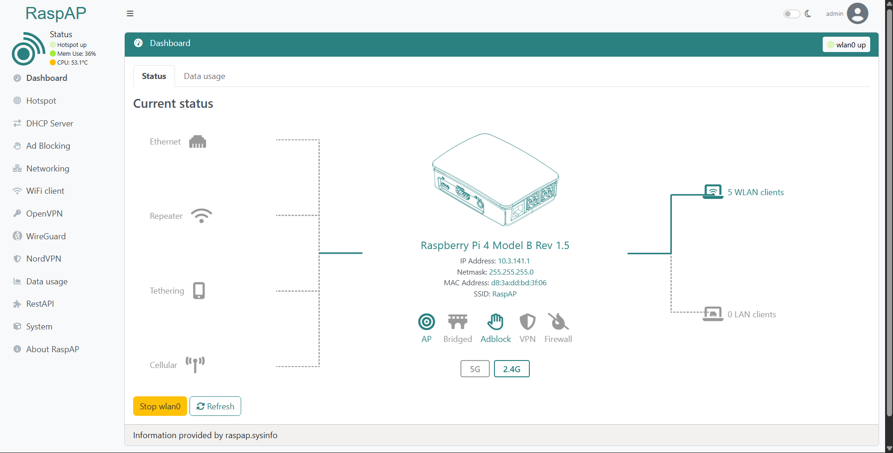
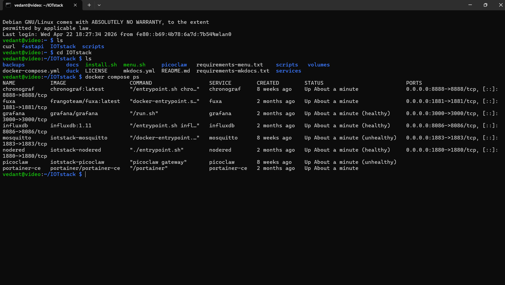
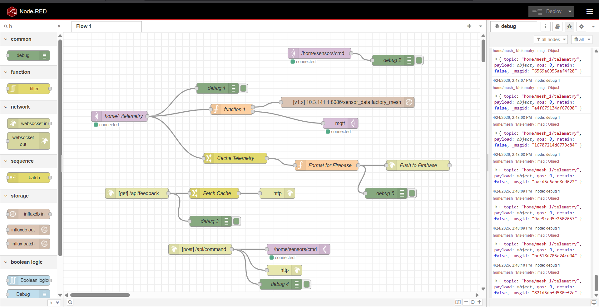
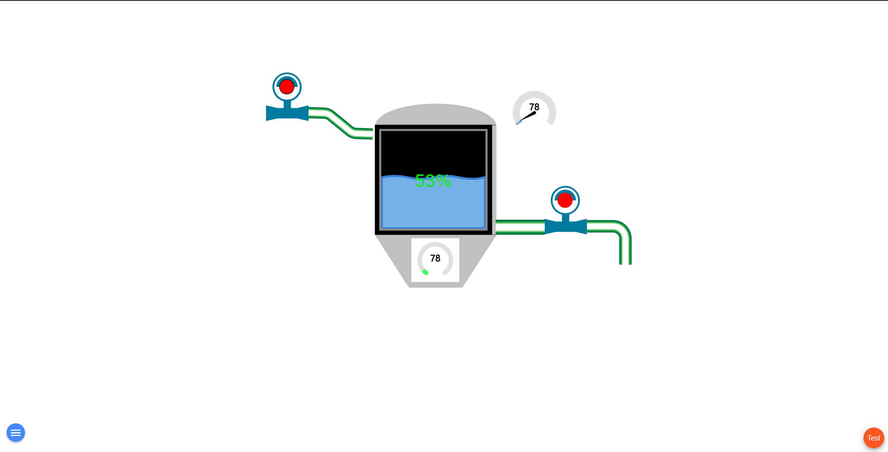
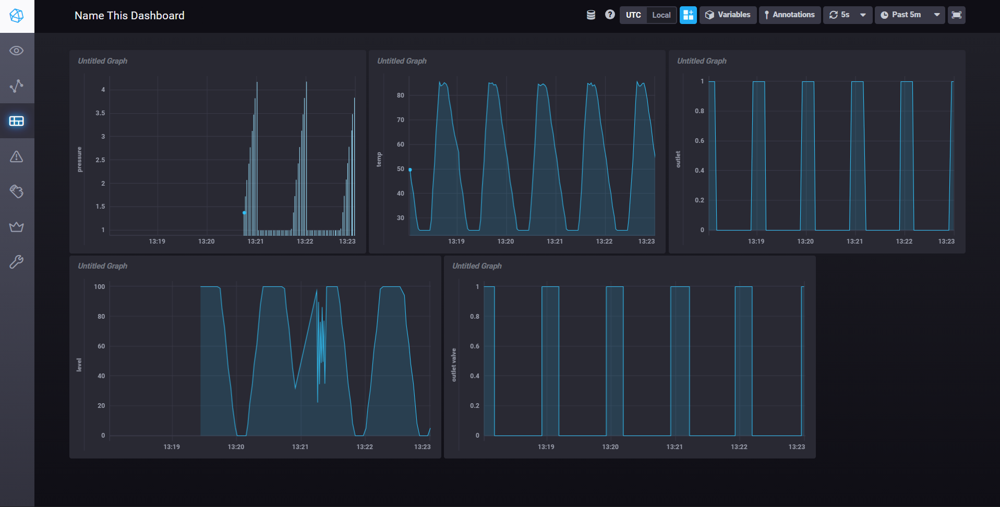

# Edge-Mesh SCADA: A Secure, Local-First Industrial IoT Framework

> Non-intrusive Industry 4.0 retrofit: real-time monitoring and a SCADA framework built on commodity hardware and open-source software.

**Dr. Vishwanath Karad MIT World Peace University, Pune** | Department of Electrical and Electronics Engineering | 2025-26

**Team:** Vedant Jadhav · Prasad Kale · Sooraj Nair

---

## Overview

Small and medium enterprises (SMEs) often cannot afford proprietary PLCs, SCADA licences, or the replacement of working legacy machines. This project shows that a full Industry 4.0 retrofit can be done **non-intrusively and at low cost**:

- ESP32 sensor nodes publish telemetry over **MQTT** (direct Wi-Fi or **ESP-MESH**).
- Legacy **RS485** machines are tapped passively via an **Arduino Uno + MAX485** bridge, with no firmware or electronics changes to the machine.
- A **Raspberry Pi 5** acts as the local edge hub and Wi-Fi access point, running the whole stack in Docker (IOTstack).
- **Node-RED** routes data in parallel to **InfluxDB** (local history), **Firebase** (cloud dashboards) and an in-memory cache (REST API).
- **Fuxa SCADA** provides the local HMI; **Chronograf/Grafana** provide analytics.
- **FastAPI** exposes REST endpoints, optionally reachable remotely through **ngrok**.

## Architecture

| Layer | Components | Protocols |
|---|---|---|
| Physical / Sensor | Industrial machines, ESP32 nodes, Arduino Uno | RS485, UART, Wi-Fi |
| Edge Hub | Raspberry Pi 5 (AP + services host, RaspAP) | TCP/IP, Wi-Fi |
| Application | Node-RED, Fuxa SCADA, InfluxDB, Chronograf, Grafana, FastAPI | MQTT, HTTP, WebSocket |
| Remote | Firebase dashboard, ngrok tunnel | HTTPS |

### Data pipelines
1. **Telemetry ingestion:** ESP32 publishes to `home/<device_id>/telemetry` → Node-RED → InfluxDB + Firebase + in-memory cache.
2. **REST feedback:** `GET /api/feedback` returns last-known telemetry from the Node-RED cache; `POST /api/command` publishes a command to `/home/sensors/cmd`.

Sample payload:
```json
{"device_id": "esp32_node_01", "status": "ONLINE", "temperature": 45.2, "rpm": 1200, "load": 78.5, "timestamp": 1700000000000}
```

## Services and ports

| Service | Port |
|---|---|
| Mosquitto (MQTT) | 1883 |
| Node-RED | 1880 |
| Fuxa SCADA | 1881 |
| Grafana | 3000 |
| InfluxDB | 8086 |
| Chronograf | 8888 |
| FastAPI / Uvicorn | 8000 |
| Pi LAN address (RaspAP) | 10.3.141.1 |

## Screenshots

### 1. Raspberry Pi edge hub: RaspAP dashboard
Raspberry Pi 4/5 acting as the Wi-Fi access point (SSID `RaspAP`, IP `10.3.141.1`) with 5 WLAN clients connected.



### 2. Containerised software stack: Docker Compose status
IOTstack services (Chronograf, Fuxa, Grafana, InfluxDB, Mosquitto, Node-RED, Portainer) running on the Pi.



### 3. Node-RED orchestration flow
MQTT ingestion (`home/+/telemetry`) routed to InfluxDB, Firebase, the in-memory cache and the REST endpoints `/api/feedback` and `/api/command`.



### 4. Fuxa SCADA: local HMI
Live tank-level view with valves, gauges and level indicator.



### 5. Chronograf: time-series analytics
Pressure, temperature, level and valve-state history stored in InfluxDB.



## Security (3-layer defence-in-depth)

1. **Authentication:** MQTT username/password.
2. **Encryption:** AES-128 ESP-MESH encryption between nodes.
3. **Firewall:** UFW on the Pi restricting ports (1883, 1880, 8000).

> **Prototype note:** the FastAPI server currently uses wildcard CORS and no API authentication (JWT planned). Do not expose it publicly in production.

## Results (prototype)

- Local latency below 200 ms, 5+ active nodes, 100% uptime during the test phase.
- Node-RED to InfluxDB pipeline latency below 50 ms; `/api/feedback` responds in under 10 ms.

## Repository structure

```
.
├── docs/
│   ├── report/Project_Report.docx
│   ├── presentation/Edge-Mesh_SCADA_Presentation.pptx
│   └── images/                 # screenshots
├── firmware/
│   ├── esp32-node/             # ESP32 (PlatformIO / Arduino) code
│   └── rs485-bridge/           # Arduino Uno + MAX485 code
├── fastapi/                    # REST API (FastAPI + Uvicorn)
├── node-red/                   # exported flows.json (remove credentials first)
├── docker/                     # docker-compose.yml / IOTstack config
└── scripts/                    # helper scripts
```

## Getting started

1. Set up the Pi 5 with Raspberry Pi OS (64-bit) and install [RaspAP](https://raspap.com) for the access point.
2. Install [IOTstack](https://github.com/SensorsIot/IOTstack) and enable Mosquitto, Node-RED, InfluxDB, Grafana, Chronograf, Fuxa and Portainer.
3. Import the flow from `node-red/` and add your own Firebase credentials (never commit them).
4. Flash the ESP32 nodes from `firmware/esp32-node/`.
5. Run the API: `cd fastapi && pip install -r requirements.txt && uvicorn main:app --host 0.0.0.0 --port 8000`

## Roadmap

- WebSocket upgrade (target under 20 ms sync) and JWT auth on FastAPI
- MQTT ACL multi-tenant isolation
- AI predictive maintenance on InfluxDB data
- Static remote access (ngrok static domain or self-hosted VPN)
- Modbus TCP, OPC-UA, EtherCAT support; OTA updates; mDNS node discovery

## License

MIT, see [LICENSE](LICENSE).
